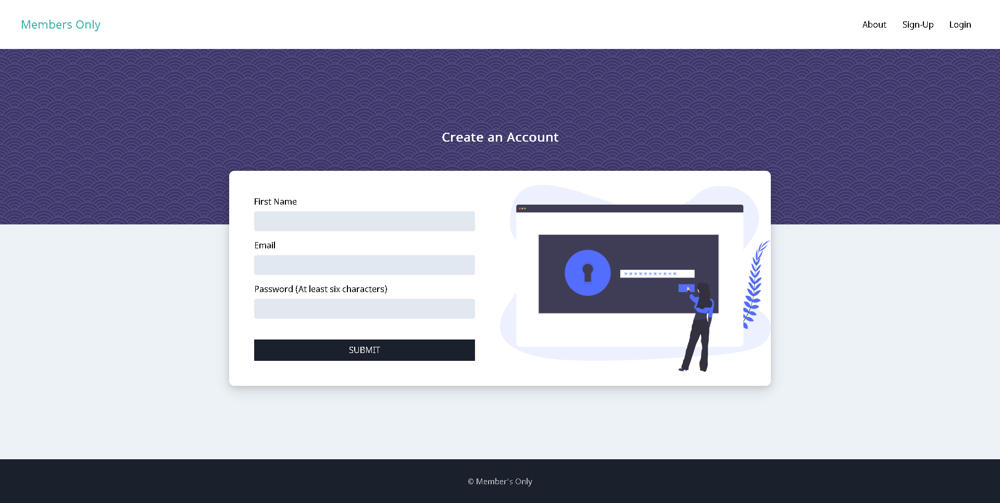

# Member's Only Message Board (Express, MongoDB, EJS, HTML, & CSS)

[Link](https://members-only-messages.herokuapp.com/)

## Features:

* User messages are hidden until a user registers as a "member" and logs in

* Ability to register a user, login, and logout 

* User authentication via Passport.js

* Bcrypt used for password hashing

* MongoDB utilized for data storage

* HTML templating achieved through EJS

* Deployment to Heroku

* Mobile-friendly layouts